**********************************************************
Comparing by resulting impact (sector,region facets) (all_sim)
**********************************************************

Comparison of indirect impacts for each variable in a facet format
with sectors as columns and regions as row. Regrouping plots by maximum size of indirect impact.

Simulation regrouped such that recovery_sce==reb15 :
~~~~~~~~~~~~~~~~~~~~~~~~~~~~~~~~~~~~~~~~~~~~~~~~~~~~~~~~~~~~~~~~~~~~~~~~~~~~~~~~~~

Variable is: production_realised
---------------------------------------

Change from initial level
^^^^^^^^^^^^^^^^^^^^^^^^^

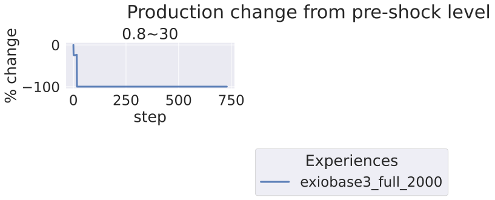

Cumulative change (expressed as percentage of yearly total)
^^^^^^^^^^^^^^^^^^^^^^^^^^^^^^^^^^^^^^^^^^^^^^^^^^^^^^^^^^^

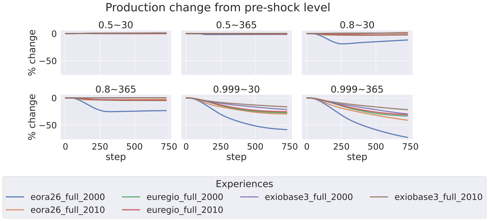

Simulation regrouped such that recovery_sce==reb15q :
~~~~~~~~~~~~~~~~~~~~~~~~~~~~~~~~~~~~~~~~~~~~~~~~~~~~~~~~~~~~~~~~~~~~~~~~~~~~~~~~~~

Variable is: production_realised
---------------------------------------

Change from initial level
^^^^^^^^^^^^^^^^^^^^^^^^^

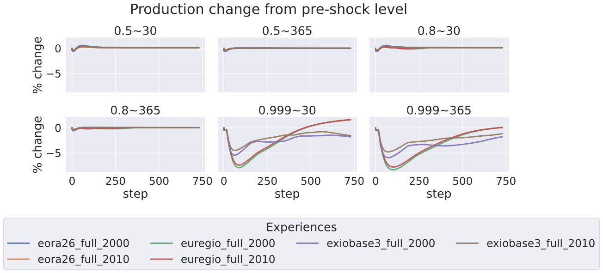

Cumulative change (expressed as percentage of yearly total)
^^^^^^^^^^^^^^^^^^^^^^^^^^^^^^^^^^^^^^^^^^^^^^^^^^^^^^^^^^^

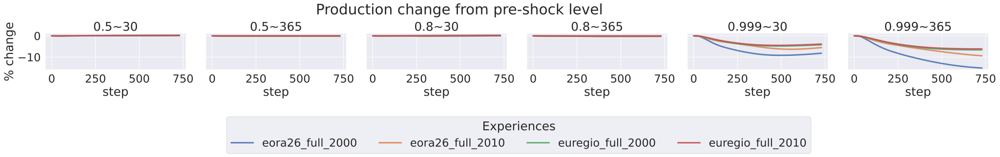

Simulation regrouped such that recovery_sce==reb365 :
~~~~~~~~~~~~~~~~~~~~~~~~~~~~~~~~~~~~~~~~~~~~~~~~~~~~~~~~~~~~~~~~~~~~~~~~~~~~~~~~~~

Variable is: production_realised
---------------------------------------

Change from initial level
^^^^^^^^^^^^^^^^^^^^^^^^^

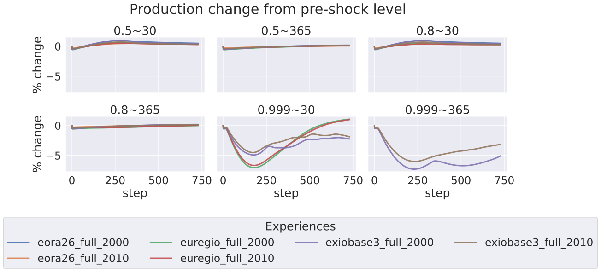

Cumulative change (expressed as percentage of yearly total)
^^^^^^^^^^^^^^^^^^^^^^^^^^^^^^^^^^^^^^^^^^^^^^^^^^^^^^^^^^^

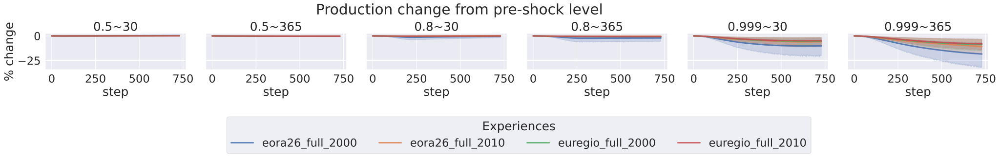

Simulation regrouped such that recovery_sce==reb545 :
~~~~~~~~~~~~~~~~~~~~~~~~~~~~~~~~~~~~~~~~~~~~~~~~~~~~~~~~~~~~~~~~~~~~~~~~~~~~~~~~~~

Variable is: production_realised
---------------------------------------

Change from initial level
^^^^^^^^^^^^^^^^^^^^^^^^^

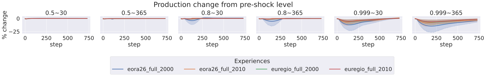

Cumulative change (expressed as percentage of yearly total)
^^^^^^^^^^^^^^^^^^^^^^^^^^^^^^^^^^^^^^^^^^^^^^^^^^^^^^^^^^^

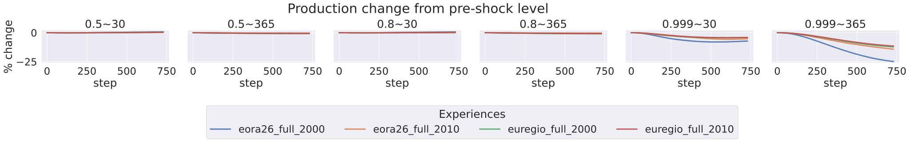

Simulation regrouped such that recovery_sce==reb90 :
~~~~~~~~~~~~~~~~~~~~~~~~~~~~~~~~~~~~~~~~~~~~~~~~~~~~~~~~~~~~~~~~~~~~~~~~~~~~~~~~~~

Variable is: production_realised
---------------------------------------

Change from initial level
^^^^^^^^^^^^^^^^^^^^^^^^^

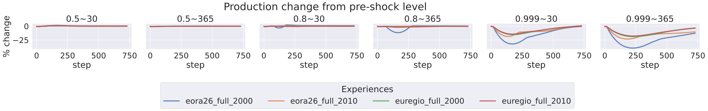

Cumulative change (expressed as percentage of yearly total)
^^^^^^^^^^^^^^^^^^^^^^^^^^^^^^^^^^^^^^^^^^^^^^^^^^^^^^^^^^^

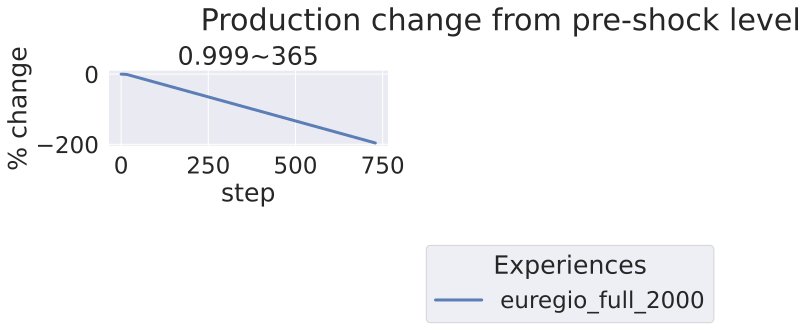

Simulation regrouped such that recovery_sce==reb90q :
~~~~~~~~~~~~~~~~~~~~~~~~~~~~~~~~~~~~~~~~~~~~~~~~~~~~~~~~~~~~~~~~~~~~~~~~~~~~~~~~~~

Variable is: production_realised
---------------------------------------

Change from initial level
^^^^^^^^^^^^^^^^^^^^^^^^^

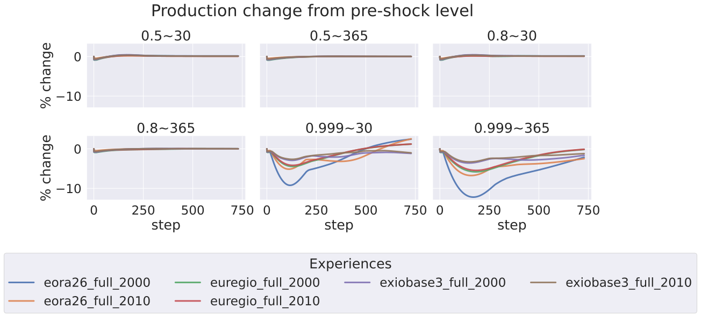

Cumulative change (expressed as percentage of yearly total)
^^^^^^^^^^^^^^^^^^^^^^^^^^^^^^^^^^^^^^^^^^^^^^^^^^^^^^^^^^^

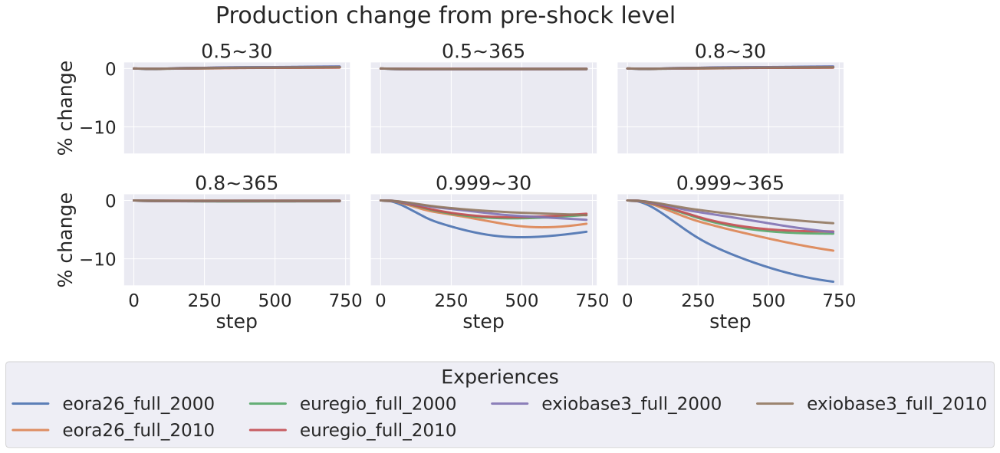

Simulation regrouped such that recovery_sce==recS2 :
~~~~~~~~~~~~~~~~~~~~~~~~~~~~~~~~~~~~~~~~~~~~~~~~~~~~~~~~~~~~~~~~~~~~~~~~~~~~~~~~~~

Variable is: production_realised
---------------------------------------

Change from initial level
^^^^^^^^^^^^^^^^^^^^^^^^^

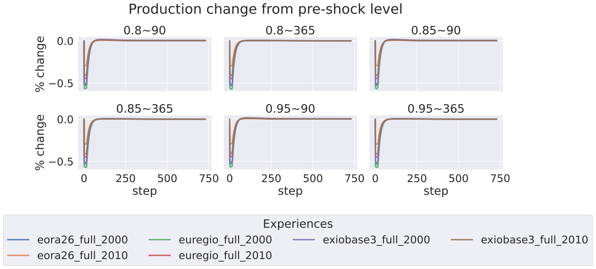

Cumulative change (expressed as percentage of yearly total)
^^^^^^^^^^^^^^^^^^^^^^^^^^^^^^^^^^^^^^^^^^^^^^^^^^^^^^^^^^^

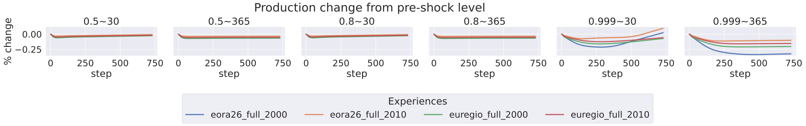

Simulation regrouped such that recovery_sce==recS6 :
~~~~~~~~~~~~~~~~~~~~~~~~~~~~~~~~~~~~~~~~~~~~~~~~~~~~~~~~~~~~~~~~~~~~~~~~~~~~~~~~~~

Variable is: production_realised
---------------------------------------

Change from initial level
^^^^^^^^^^^^^^^^^^^^^^^^^

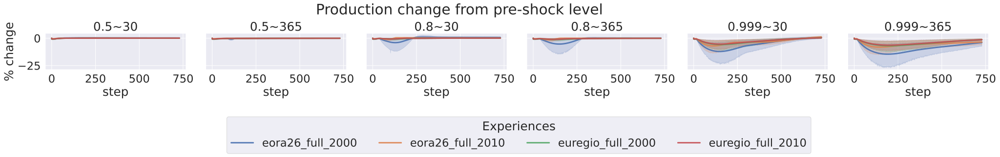

Cumulative change (expressed as percentage of yearly total)
^^^^^^^^^^^^^^^^^^^^^^^^^^^^^^^^^^^^^^^^^^^^^^^^^^^^^^^^^^^

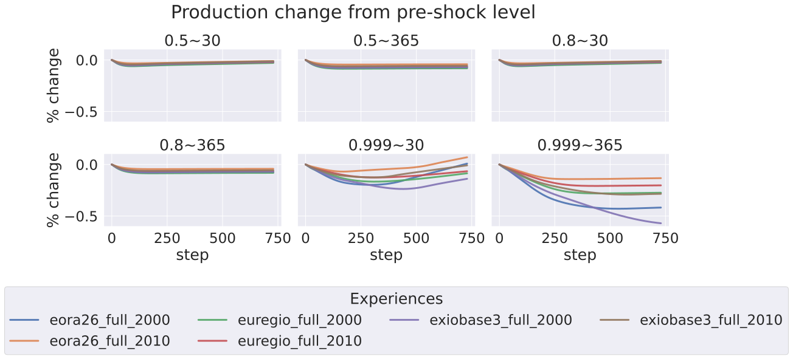

Simulation regrouped such that recovery_sce==recfast :
~~~~~~~~~~~~~~~~~~~~~~~~~~~~~~~~~~~~~~~~~~~~~~~~~~~~~~~~~~~~~~~~~~~~~~~~~~~~~~~~~~

Variable is: production_realised
---------------------------------------

Change from initial level
^^^^^^^^^^^^^^^^^^^^^^^^^

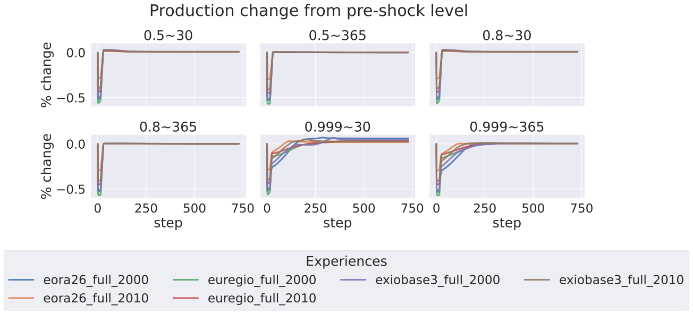

Cumulative change (expressed as percentage of yearly total)
^^^^^^^^^^^^^^^^^^^^^^^^^^^^^^^^^^^^^^^^^^^^^^^^^^^^^^^^^^^

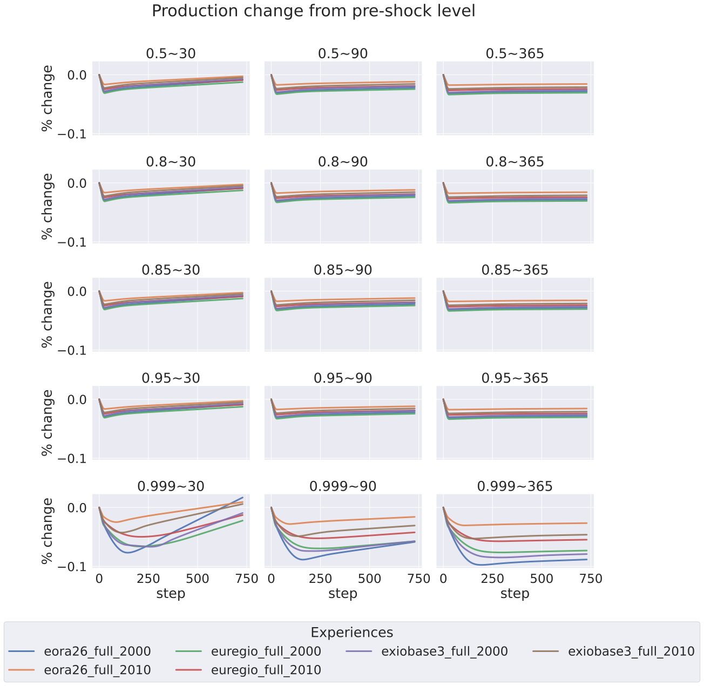

Simulation regrouped such that recovery_sce==reclin2 :
~~~~~~~~~~~~~~~~~~~~~~~~~~~~~~~~~~~~~~~~~~~~~~~~~~~~~~~~~~~~~~~~~~~~~~~~~~~~~~~~~~

Variable is: production_realised
---------------------------------------

Change from initial level
^^^^^^^^^^^^^^^^^^^^^^^^^

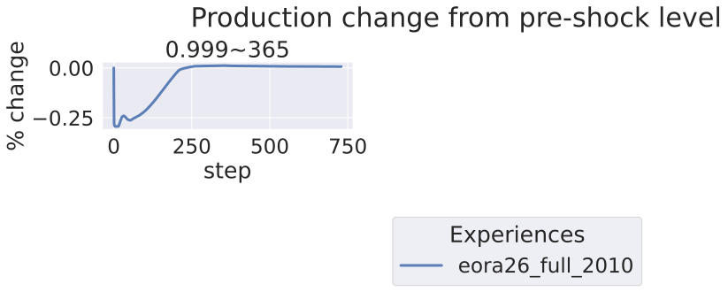

Cumulative change (expressed as percentage of yearly total)
^^^^^^^^^^^^^^^^^^^^^^^^^^^^^^^^^^^^^^^^^^^^^^^^^^^^^^^^^^^

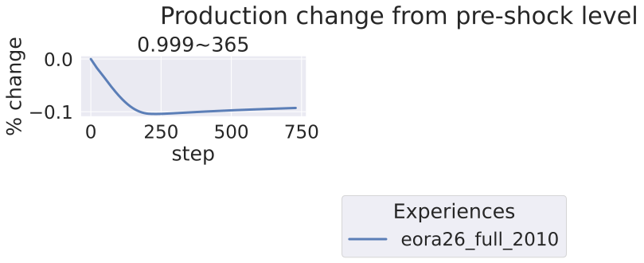

Simulation regrouped such that recovery_sce==reclin6 :
~~~~~~~~~~~~~~~~~~~~~~~~~~~~~~~~~~~~~~~~~~~~~~~~~~~~~~~~~~~~~~~~~~~~~~~~~~~~~~~~~~

Variable is: production_realised
---------------------------------------

Change from initial level
^^^^^^^^^^^^^^^^^^^^^^^^^

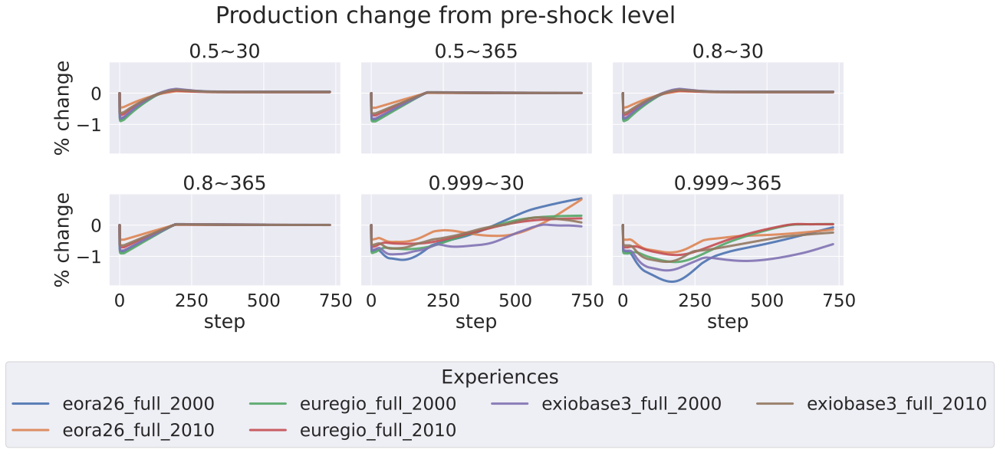

Cumulative change (expressed as percentage of yearly total)
^^^^^^^^^^^^^^^^^^^^^^^^^^^^^^^^^^^^^^^^^^^^^^^^^^^^^^^^^^^

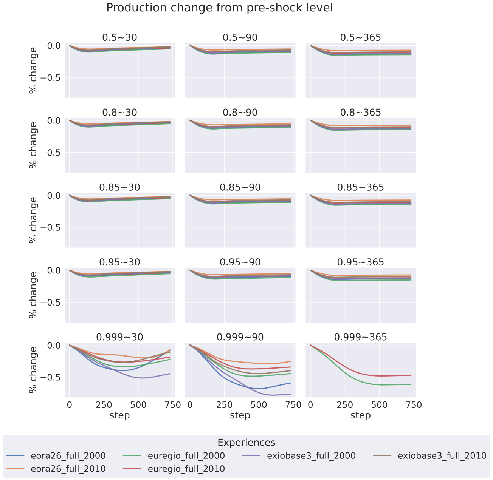

