*******************************************************************************
Comparing by params for the affected region (recover scenario facets) (no_absurd)
*******************************************************************************

Comparison of indirect impacts for each variable in a facet format
based on recovery scenario. Regrouping plot by common parameters.

Simulation regrouped such that recovery_sce==reb1Y :
~~~~~~~~~~~~~~~~~~~~~~~~~~~~~~~~~~~~~~~~~~~~~~~~~~~~~~~~~~~~~~~~~~~~~~~~~~~~~~~~~~

Variable is: production_realised
---------------------------------------

Change from initial level
^^^^^^^^^^^^^^^^^^^^^^^^^

Cumulative change (expressed as percentage of yearly total)
^^^^^^^^^^^^^^^^^^^^^^^^^^^^^^^^^^^^^^^^^^^^^^^^^^^^^^^^^^^

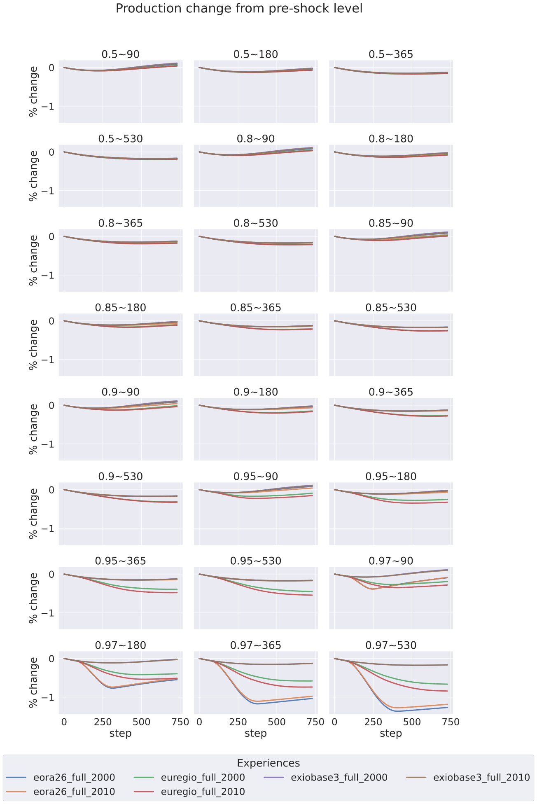

Simulation regrouped such that recovery_sce==reb1_5Y :
~~~~~~~~~~~~~~~~~~~~~~~~~~~~~~~~~~~~~~~~~~~~~~~~~~~~~~~~~~~~~~~~~~~~~~~~~~~~~~~~~~

Variable is: production_realised
---------------------------------------

Change from initial level
^^^^^^^^^^^^^^^^^^^^^^^^^

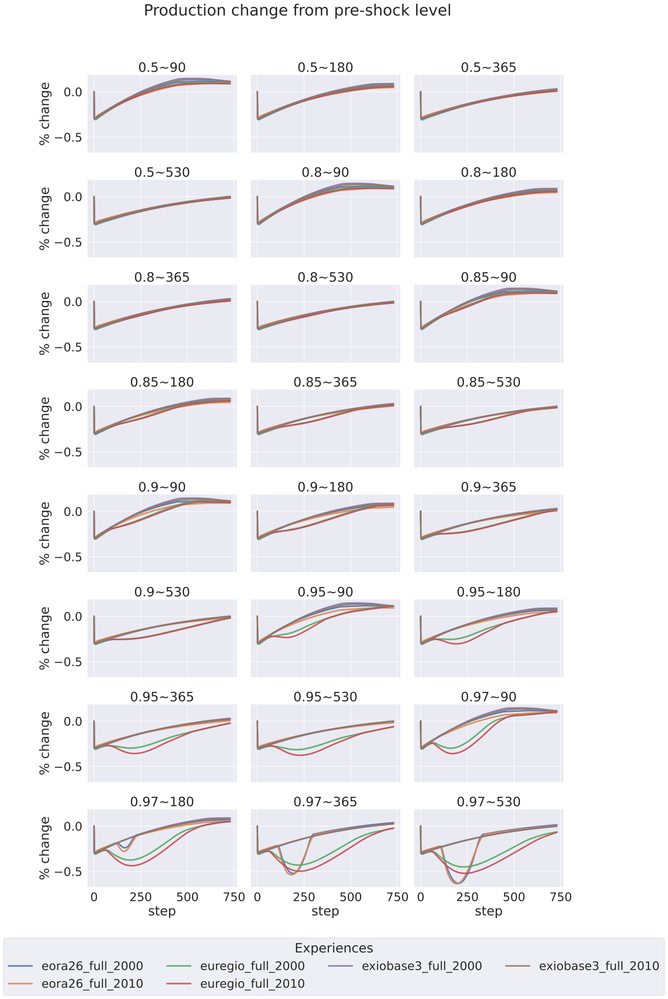

Cumulative change (expressed as percentage of yearly total)
^^^^^^^^^^^^^^^^^^^^^^^^^^^^^^^^^^^^^^^^^^^^^^^^^^^^^^^^^^^

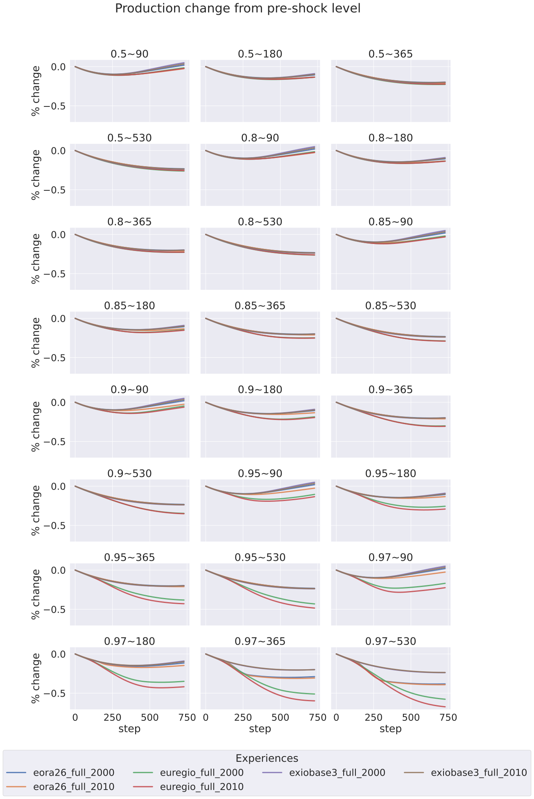

Simulation regrouped such that recovery_sce==reb2Y :
~~~~~~~~~~~~~~~~~~~~~~~~~~~~~~~~~~~~~~~~~~~~~~~~~~~~~~~~~~~~~~~~~~~~~~~~~~~~~~~~~~

Variable is: production_realised
---------------------------------------

Change from initial level
^^^^^^^^^^^^^^^^^^^^^^^^^

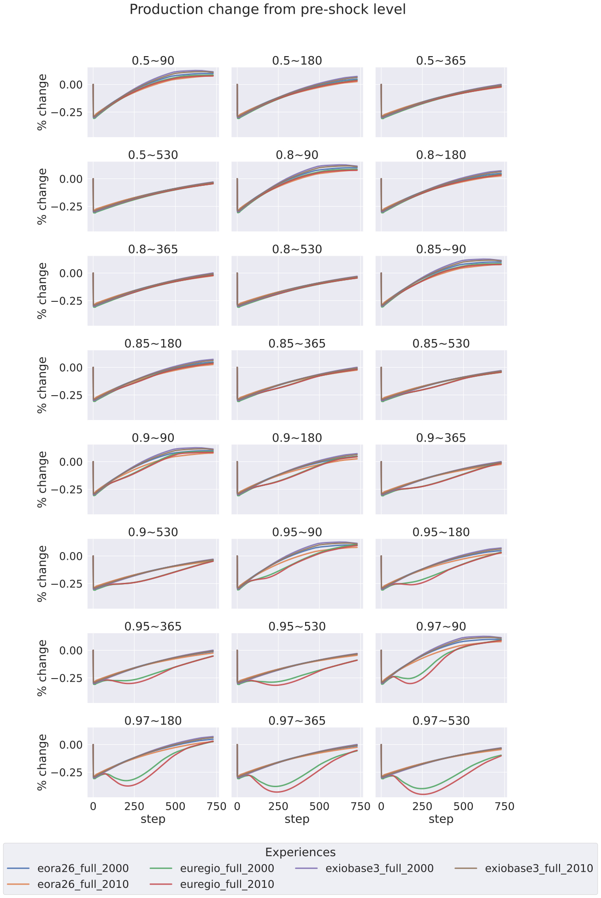

Cumulative change (expressed as percentage of yearly total)
^^^^^^^^^^^^^^^^^^^^^^^^^^^^^^^^^^^^^^^^^^^^^^^^^^^^^^^^^^^

Simulation regrouped such that recovery_sce==reb3M :
~~~~~~~~~~~~~~~~~~~~~~~~~~~~~~~~~~~~~~~~~~~~~~~~~~~~~~~~~~~~~~~~~~~~~~~~~~~~~~~~~~

Variable is: production_realised
---------------------------------------

Change from initial level
^^^^^^^^^^^^^^^^^^^^^^^^^

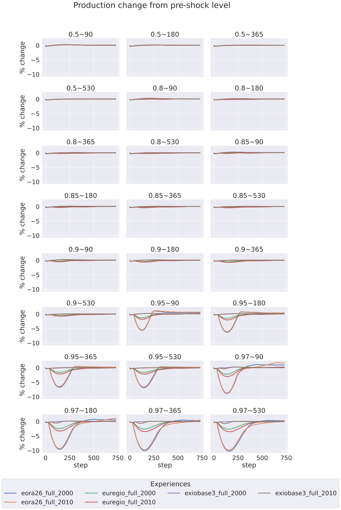

Cumulative change (expressed as percentage of yearly total)
^^^^^^^^^^^^^^^^^^^^^^^^^^^^^^^^^^^^^^^^^^^^^^^^^^^^^^^^^^^

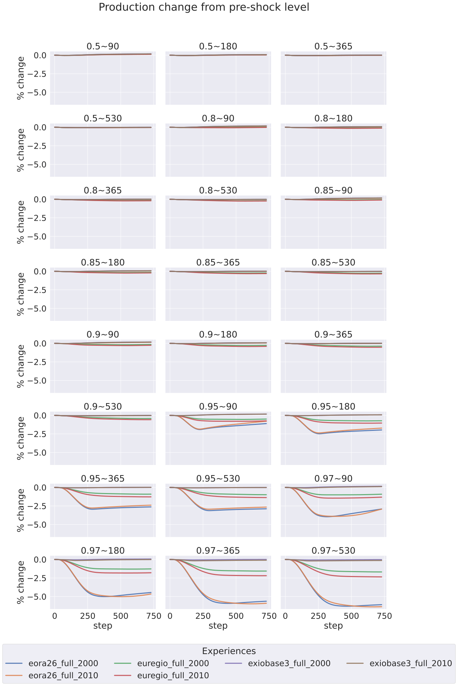

Simulation regrouped such that recovery_sce==reb6M :
~~~~~~~~~~~~~~~~~~~~~~~~~~~~~~~~~~~~~~~~~~~~~~~~~~~~~~~~~~~~~~~~~~~~~~~~~~~~~~~~~~

Variable is: production_realised
---------------------------------------

Change from initial level
^^^^^^^^^^^^^^^^^^^^^^^^^

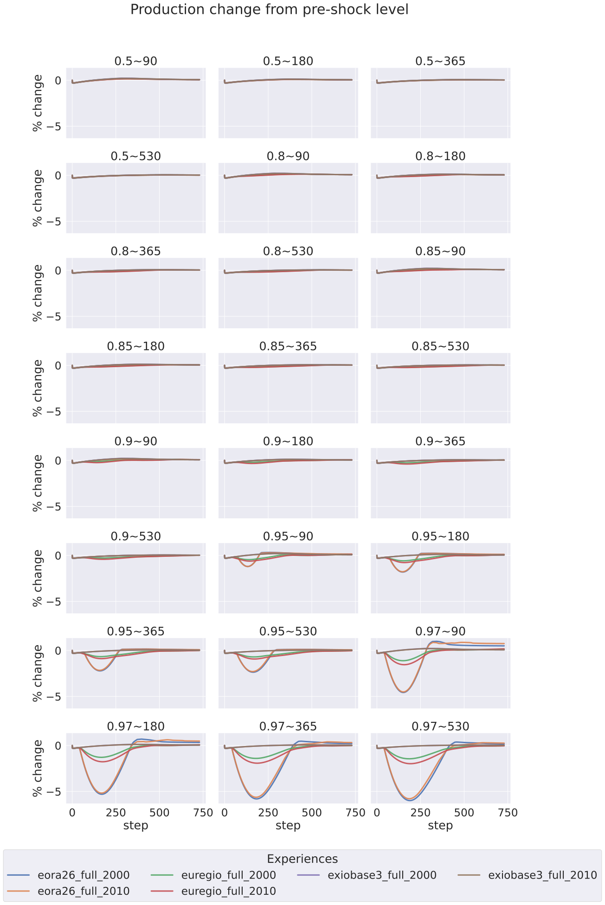

Cumulative change (expressed as percentage of yearly total)
^^^^^^^^^^^^^^^^^^^^^^^^^^^^^^^^^^^^^^^^^^^^^^^^^^^^^^^^^^^

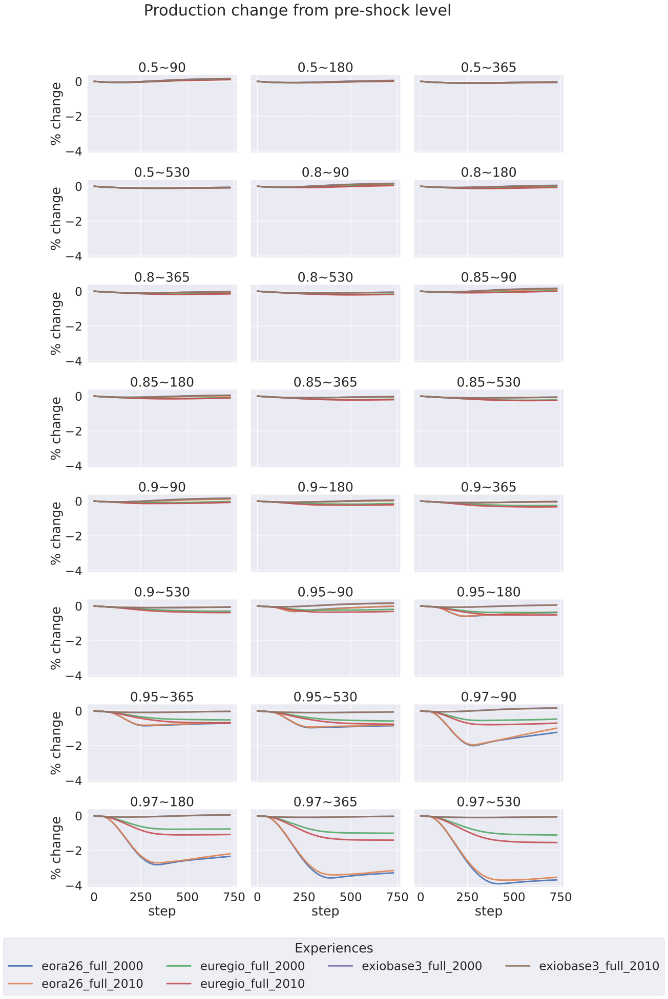

Simulation regrouped such that recovery_sce==recS1Y :
~~~~~~~~~~~~~~~~~~~~~~~~~~~~~~~~~~~~~~~~~~~~~~~~~~~~~~~~~~~~~~~~~~~~~~~~~~~~~~~~~~

Variable is: production_realised
---------------------------------------

Change from initial level
^^^^^^^^^^^^^^^^^^^^^^^^^

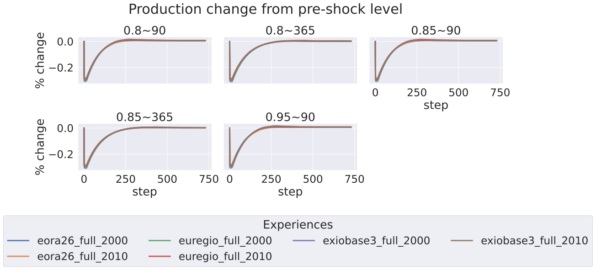

Cumulative change (expressed as percentage of yearly total)
^^^^^^^^^^^^^^^^^^^^^^^^^^^^^^^^^^^^^^^^^^^^^^^^^^^^^^^^^^^

Simulation regrouped such that recovery_sce==recS1_5Y :
~~~~~~~~~~~~~~~~~~~~~~~~~~~~~~~~~~~~~~~~~~~~~~~~~~~~~~~~~~~~~~~~~~~~~~~~~~~~~~~~~~

Variable is: production_realised
---------------------------------------

Change from initial level
^^^^^^^^^^^^^^^^^^^^^^^^^

Cumulative change (expressed as percentage of yearly total)
^^^^^^^^^^^^^^^^^^^^^^^^^^^^^^^^^^^^^^^^^^^^^^^^^^^^^^^^^^^

Simulation regrouped such that recovery_sce==recS6M :
~~~~~~~~~~~~~~~~~~~~~~~~~~~~~~~~~~~~~~~~~~~~~~~~~~~~~~~~~~~~~~~~~~~~~~~~~~~~~~~~~~

Variable is: production_realised
---------------------------------------

Change from initial level
^^^^^^^^^^^^^^^^^^^^^^^^^

Cumulative change (expressed as percentage of yearly total)
^^^^^^^^^^^^^^^^^^^^^^^^^^^^^^^^^^^^^^^^^^^^^^^^^^^^^^^^^^^

Simulation regrouped such that recovery_sce==reclin1Y :
~~~~~~~~~~~~~~~~~~~~~~~~~~~~~~~~~~~~~~~~~~~~~~~~~~~~~~~~~~~~~~~~~~~~~~~~~~~~~~~~~~

Variable is: production_realised
---------------------------------------

Change from initial level
^^^^^^^^^^^^^^^^^^^^^^^^^

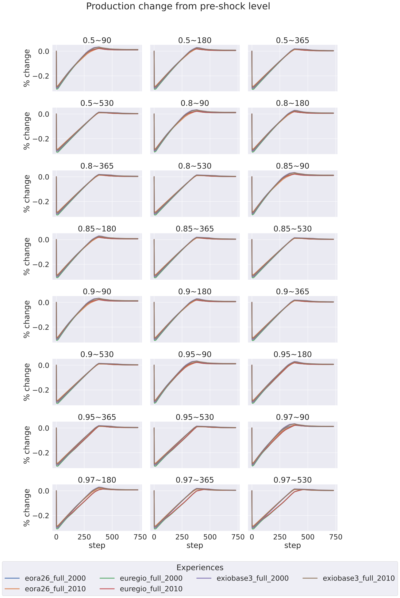

Cumulative change (expressed as percentage of yearly total)
^^^^^^^^^^^^^^^^^^^^^^^^^^^^^^^^^^^^^^^^^^^^^^^^^^^^^^^^^^^

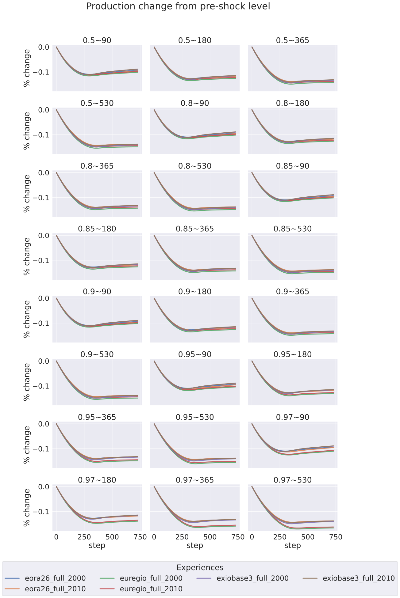

Simulation regrouped such that recovery_sce==reclin1_5Y :
~~~~~~~~~~~~~~~~~~~~~~~~~~~~~~~~~~~~~~~~~~~~~~~~~~~~~~~~~~~~~~~~~~~~~~~~~~~~~~~~~~

Variable is: production_realised
---------------------------------------

Change from initial level
^^^^^^^^^^^^^^^^^^^^^^^^^

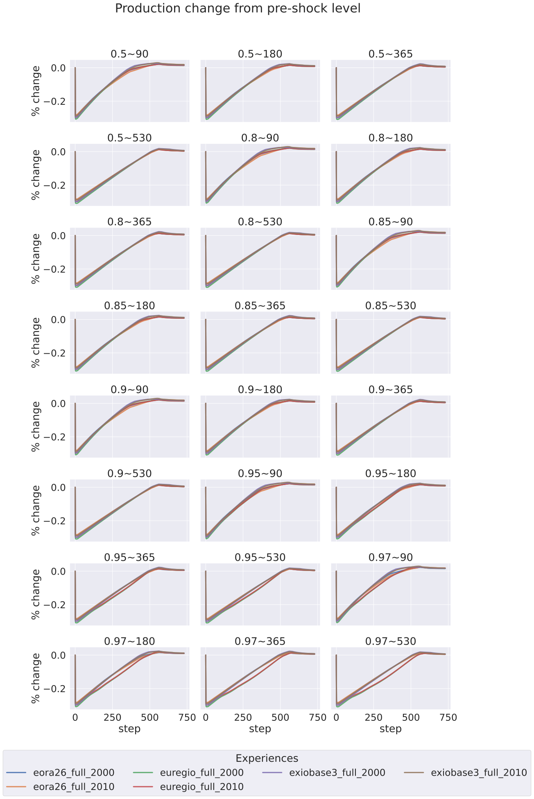

Cumulative change (expressed as percentage of yearly total)
^^^^^^^^^^^^^^^^^^^^^^^^^^^^^^^^^^^^^^^^^^^^^^^^^^^^^^^^^^^

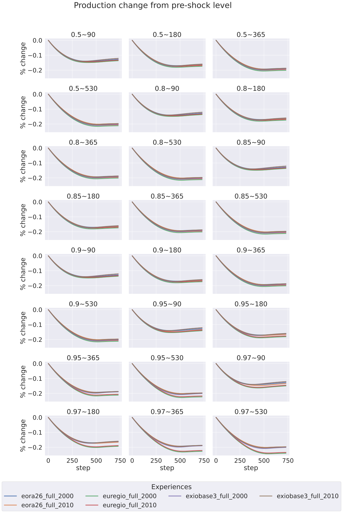

Simulation regrouped such that recovery_sce==reclin3M :
~~~~~~~~~~~~~~~~~~~~~~~~~~~~~~~~~~~~~~~~~~~~~~~~~~~~~~~~~~~~~~~~~~~~~~~~~~~~~~~~~~

Variable is: production_realised
---------------------------------------

Change from initial level
^^^^^^^^^^^^^^^^^^^^^^^^^

Cumulative change (expressed as percentage of yearly total)
^^^^^^^^^^^^^^^^^^^^^^^^^^^^^^^^^^^^^^^^^^^^^^^^^^^^^^^^^^^

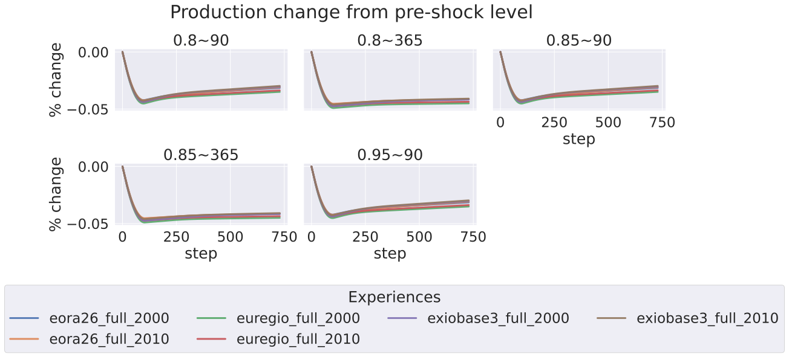

Simulation regrouped such that recovery_sce==reclin6M :
~~~~~~~~~~~~~~~~~~~~~~~~~~~~~~~~~~~~~~~~~~~~~~~~~~~~~~~~~~~~~~~~~~~~~~~~~~~~~~~~~~

Variable is: production_realised
---------------------------------------

Change from initial level
^^^^^^^^^^^^^^^^^^^^^^^^^

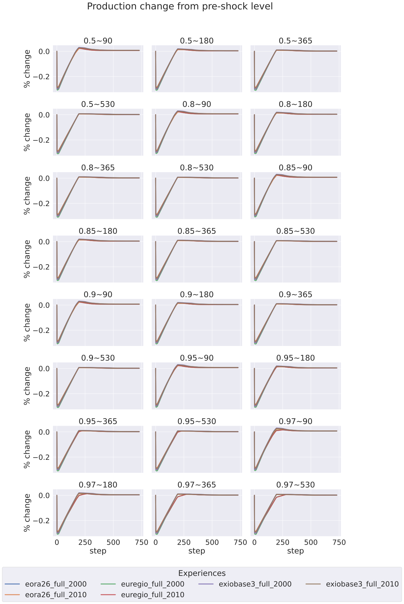

Cumulative change (expressed as percentage of yearly total)
^^^^^^^^^^^^^^^^^^^^^^^^^^^^^^^^^^^^^^^^^^^^^^^^^^^^^^^^^^^

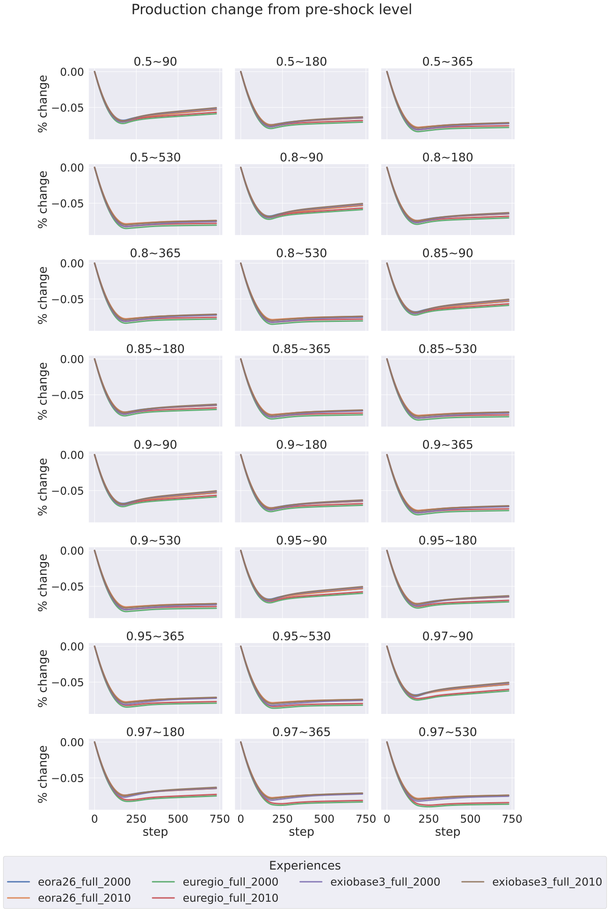

