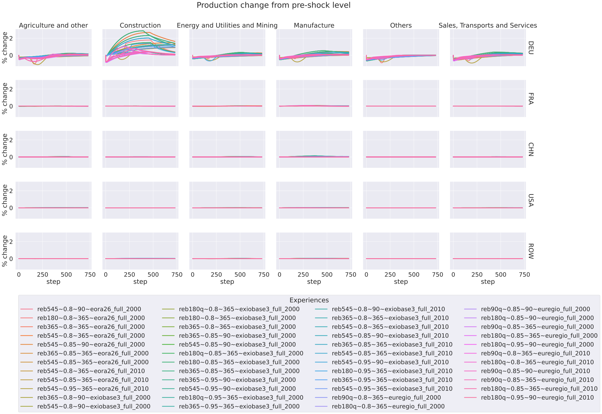
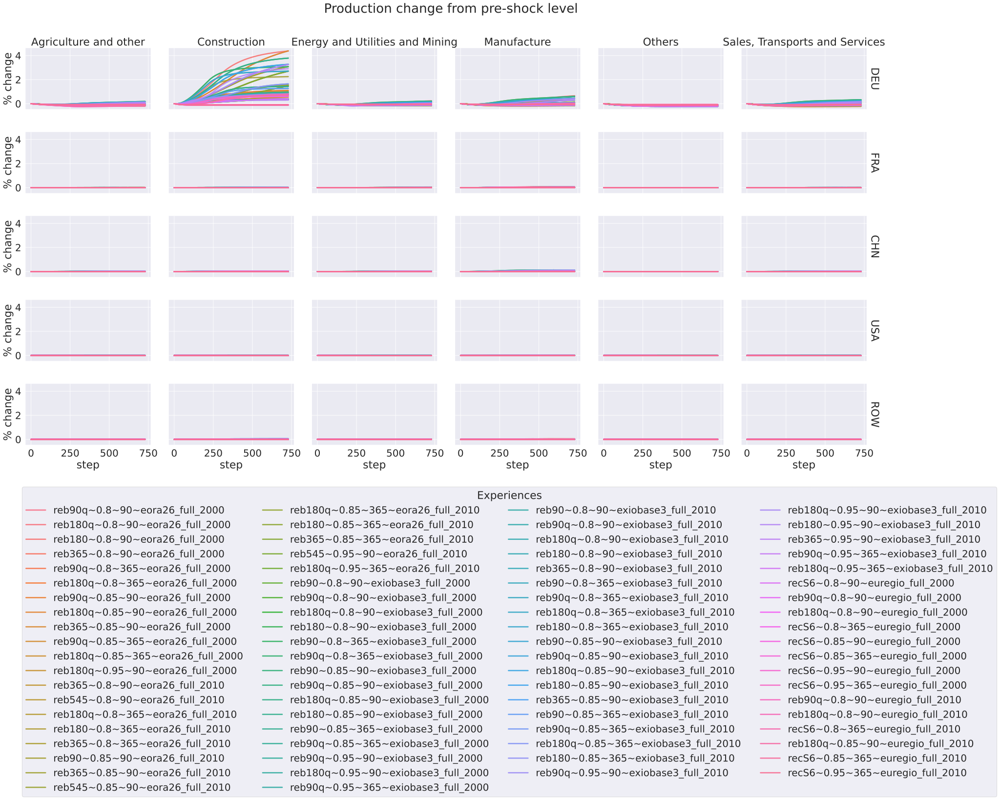

**************************************************************************************************************************************************************
Comparing by resulting impact (sector,region facets) (all_sim)
**************************************************************************************************************************************************************

Comparison of indirect impacts for each variable in a facet format
with sectors as columns and regions as row. Regrouping plots by maximum size of indirect impact.

Simulation regrouped such that cumsum_impact_class==0_5L0_25 :
~~~~~~~~~~~~~~~~~~~~~~~~~~~~~~~~~~~~~~~~~~~~~~~~~~~~~~~~~~~~~~~~~~~~~~~~~~~~~~~~~~

Variable is: production_realised
---------------------------------------

Change from initial level
^^^^^^^^^^^^^^^^^^^^^^^^^

Cumulative change (expressed as percentage of yearly total)
^^^^^^^^^^^^^^^^^^^^^^^^^^^^^^^^^^^^^^^^^^^^^^^^^^^^^^^^^^^

.. image:: ../../../images/figs/general/all_sim/cumsum_impact_class~0_5L0_25/sectorXregion~Experience/production_realised_cumsum.svg
    :alt: No data to plot (possibly because no simulation correspond to this scope/selection)

Simulation regrouped such that cumsum_impact_class==0_25L0_1 :
~~~~~~~~~~~~~~~~~~~~~~~~~~~~~~~~~~~~~~~~~~~~~~~~~~~~~~~~~~~~~~~~~~~~~~~~~~~~~~~~~~

Variable is: production_realised
---------------------------------------

Change from initial level
^^^^^^^^^^^^^^^^^^^^^^^^^

.. image:: ../../../images/figs/general/all_sim/cumsum_impact_class~0_25L0_1/sectorXregion~Experience/production_realised_classic.svg
    :alt: No data to plot (possibly because no simulation correspond to this scope/selection)

Cumulative change (expressed as percentage of yearly total)
^^^^^^^^^^^^^^^^^^^^^^^^^^^^^^^^^^^^^^^^^^^^^^^^^^^^^^^^^^^

Simulation regrouped such that cumsum_impact_class==0_1L0 :
~~~~~~~~~~~~~~~~~~~~~~~~~~~~~~~~~~~~~~~~~~~~~~~~~~~~~~~~~~~~~~~~~~~~~~~~~~~~~~~~~~

Variable is: production_realised
---------------------------------------

Change from initial level
^^^^^^^^^^^^^^^^^^^^^^^^^

.. image:: ../../../images/figs/general/all_sim/cumsum_impact_class~0_1L0/sectorXregion~Experience/production_realised_classic.svg
    :alt: No data to plot (possibly because no simulation correspond to this scope/selection)

Cumulative change (expressed as percentage of yearly total)
^^^^^^^^^^^^^^^^^^^^^^^^^^^^^^^^^^^^^^^^^^^^^^^^^^^^^^^^^^^

.. image:: ../../../images/figs/general/all_sim/cumsum_impact_class~0_1L0/sectorXregion~Experience/production_realised_cumsum.svg
    :alt: No data to plot (possibly because no simulation correspond to this scope/selection)

